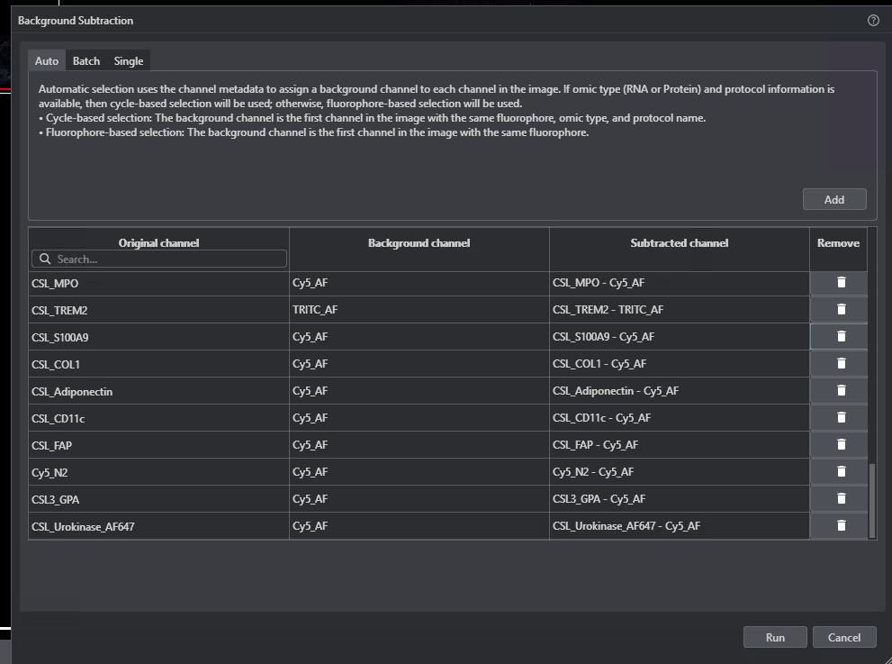

We have data coming off our lunaphore comet machine which needs to be background subtracted in horizon viewer (https://lunaphore.com/products/horizon/) before analysis in qupath.

I am unsure of what the exact mechinism is used for bajcground subtraction however we do have this in our segmentation pipeline a container "ghcr.io/schapirolabor/background_subtraction:v0.4.1" and https://github.com/WEHI-SODA-Hub/sp_segment/blob/main/modules/nf-core/backsub/main.nf. this is the github https://github.com/schapirolabor/background_subtraction

Ideally we would like to detect the channels and negative controls teh same as how auto mode detects teh correct background channel in horizon veiwer in the image below:

a path to the installed version of horizon veiwer is /stornext/Img/data/prkfs1/m/Microscopy/COMET/Customer\ Folder/HORIZON Viewer_2.3.0.0.exe.

You can follow the schema and profiles of /vast/scratch/users/mckay.m/export_large_annotation_regions to build the nextflow pipeline. a pyhton based pipeline I have made is at /vast/scratch/users/mckay.m/opal_inform_stitch which runs with the conbda profile which is mostly what I wouold like to use.

I would like the following to happen, the user submits paths to a bunch of non-subtracted images as well as output paths, these images are processed on multile hpc nodes in paralellel to produce ome.tiff files which can be analysed in qupath. make sure to pay special attention to the ome.xml metdata of the images this is how the channels and negative control channels are detected.

I have included an image at /vast/scratch/users/mckay.m/Comet-background-subtraction/20260701_191242_1_s9tJga_CSL_batch1_cohort_25.1592.1A_26.948.1.Y.Z.tiff which has not been subtracted 

Subtracted image to compare to /vast/scratch/users/mckay.m/Comet-background-subtraction/20260701_191242_1_s9tJga_CSL_batch1_cohort_25_1592_1.ome.ome.tiff

Original path cd /stornext/Img/data/prkfs1/m/Microscopy/COMET/LC2025005_Atherosclerosis\ lab/20260701_191242_1_s9tJga_CSL_batch1_cohort_25.1592.1A_26.948.1.Y.Z